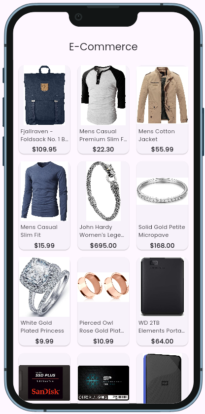
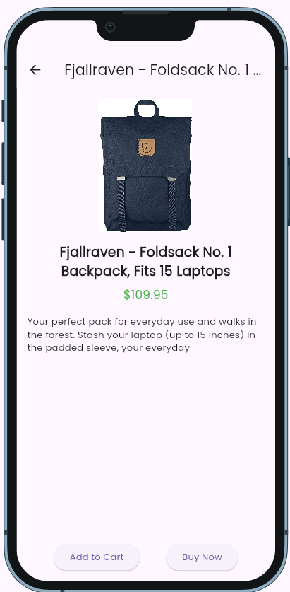

# 🛒 Flutter E-Commerce App

A simple and beautiful Flutter-based e-commerce application that fetches products from [FakeStoreAPI](https://fakestoreapi.com/products).  
This app displays a grid of products, shows detailed product views, and supports responsive layout testing using Device Preview.

---

## 📸 Screenshots

| Home Screen                     | Product Details                    |
|---------------------------------|------------------------------------|
|  |  |

> 📌 Place your screenshots in the `screenshots/` folder in the root of the project.

---

## ✨ Features

- 📦 Fetches product data from FakeStoreAPI
- 🖼️ Caches product images for smooth and fast loading
- 🛙️ Displays products in a clean 3-column grid layout
- 📄 Shows full product details including image, price, and description
- 🔋 Stylish typography using Google Fonts
- 📱 Supports device preview for responsive design testing

---

## 🚀 Getting Started

Follow the steps below to run this project on your local machine:

### ✅ Prerequisites

- Flutter SDK installed
- A code editor (VS Code / Android Studio)
- An emulator or a real device

### 🧾 Installation

```bash
# Clone this repository
git clone https://github.com/your-username/flutter-ecommerce-app.git

# Navigate to the project directory
cd flutter-ecommerce-app

# Install dependencies
flutter pub get

# Run the app
flutter run
```

---

## 🗂️ Folder Structure

```
flutter-ecommerce-app/
├── lib/
│   ├── main.dart                         # App entry point
│   ├── models/
│   │   └── product_model.dart            # Product data model
│   ├── screens/
│   │   ├── home_screen.dart              # Home screen with product grid
│   │   └── product_detail_screen.dart    # Product detail screen
│   └── widgets/
│       └── product_card.dart             # Reusable product card widget
├── screenshots/
│   ├── home.png                          # Home screen screenshot
│   └── details.png                       # Product details screenshot
├── pubspec.yaml                          # Dependencies and assets
├── README.md                             # Project documentation
└── LICENSE                               # License (optional)
```

---

## 📦 Packages Used

| Package              | Description                                 |
|----------------------|---------------------------------------------|
| `http`               | Fetches data from the FakeStore API         |
| `cached_network_image` | Caches images for faster loading           |
| `google_fonts`       | Applies custom fonts from Google Fonts      |
| `device_preview`     | Previews the app on different screen sizes  |

---

## 👤 Author

Developed with ❤️ by **Shoaib**  
🎓 CSE Student — *University of Chittagong*  
🌐 GitHub: [S-h-o-a-i-b](https://github.com/S-h-o-a-i-b)  
📬 Email: [shoaibcsecu@gmail.com](mailto:shoaibcsecu@gmail.com)

---

